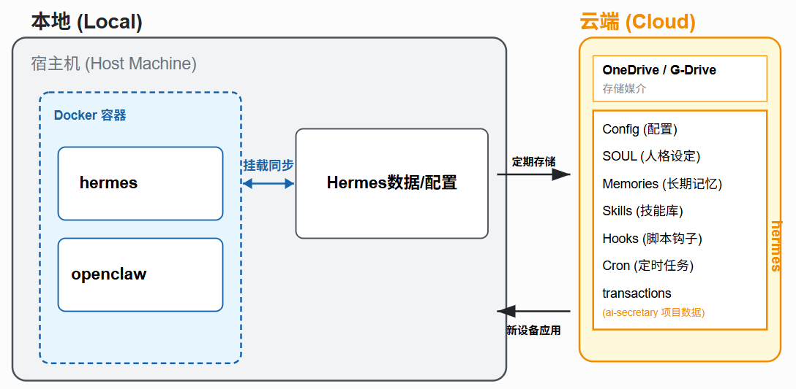

# aisecretary

为 Hermes 助手提供事务管理能力的本地 API 服务。Hermes 通过自然语言接收事务指令，调用本服务的 REST API 完成增删查改，数据持久化到本机 SQLite。

## 架构



```
飞书 → Hermes（Docker 容器）→ http://host.docker.internal:8000 → FastAPI（宿主机）→ SQLite
```

- API 服务运行在宿主机，绑定 `0.0.0.0:8000`
- Hermes 运行在 Docker 容器内，通过 `host.docker.internal:8000` 访问宿主机
- 数据库默认存放在 `~/data/aisecretary/transactions.sqlite`（repo 外，由 myopenclaw 统一备份）

## 快速开始（新 Mac）

前置条件：Hermes 已通过 [myopenclaw](https://github.com/OuyangWenyu/myopenclaw) 启动，飞书已配置。

```bash
git clone <仓库地址> ~/code/aisecretary
cd ~/code/aisecretary
bash scripts/bootstrap_hermes.sh   # 注册 skill、注入 SOUL.md
bash scripts/start_local_api.sh    # 前台启动 API（新开终端运行）
bash scripts/verify_hermes_wiring.sh  # 验证接线
```

## 日常操作

### 更新代码后

```bash
cd ~/code/aisecretary
git pull
bash scripts/bootstrap_hermes.sh   # 幂等，可安全重复执行
# 如需重启 API：
bash scripts/start_local_api.sh
```

### 验证接线

```bash
bash scripts/verify_hermes_wiring.sh
```

预期输出：`3 passed, 0 failed`

## 数据库与备份

数据库默认路径：`~/data/aisecretary/transactions.sqlite`

可通过 `.env` 文件自定义（参考 `.env.example`）。

备份由 [myopenclaw](https://github.com/OuyangWenyu/myopenclaw) 的 `backup-cron` 容器统一管理，与 Hermes、OpenClaw 数据快照一起定时备份到云盘。本仓库不负责备份。

## API 手动验证

服务启动后在宿主机终端执行：

### 健康检查

```bash
curl http://127.0.0.1:8000/health
```

预期返回：`{"status":"ok"}`

### 创建事务

```bash
curl -X POST http://127.0.0.1:8000/transactions \
  -H "Content-Type: application/json" \
  -d '{"title":"合作伙伴跟进","owner":"Owen","next_action":"确认下次会议时间"}'
```

预期返回：`201 Created`，含 `id` 字段。

### 查询事务列表

```bash
curl http://127.0.0.1:8000/transactions
```

### 更新事务

```bash
curl -X PATCH http://127.0.0.1:8000/transactions/<id> \
  -H "Content-Type: application/json" \
  -d '{"status":"waiting_feedback","next_action":"等待对方确认会议时间"}'
```

### 汇总事务

```bash
curl http://127.0.0.1:8000/transactions/summary
```

## 飞书自然语言测试

API 运行且 Hermes 已加载 skill 后，在飞书发送：

```
记录一个事务：和合作团队推进合作，负责人 Owen，下一步确认下次会议时间。
现在有哪些事务？
把 ID 为 <id> 的事务改成等待反馈。
汇总当前事务。
```

Hermes 应分别映射到 `POST /transactions`、`GET /transactions`、`PATCH /transactions/{id}`、`GET /transactions/summary`。

## 开发

```bash
uv sync
uv run pytest
uv run uvicorn server.app.main:app --host 127.0.0.1 --port 8000 --reload
```
