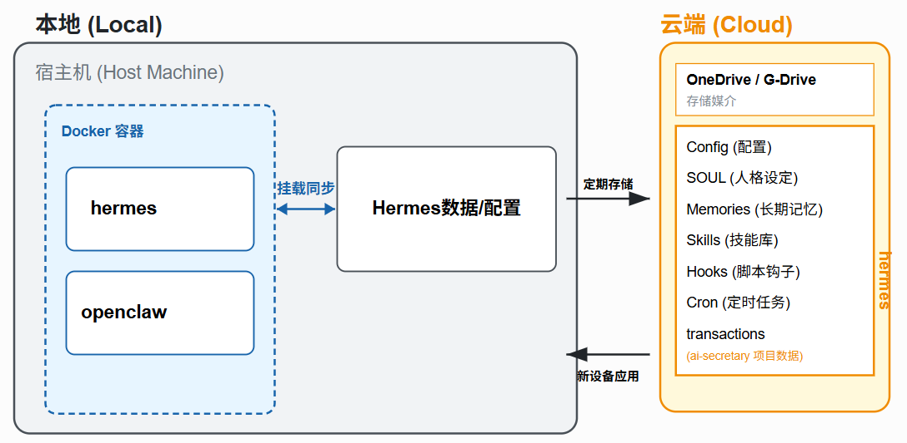

# aisecretary

为 Hermes 助手提供事务管理能力的本地 API 服务。Hermes 通过自然语言接收事务指令，调用本服务的 REST API 完成增删查改，数据持久化到本机 SQLite。

## 架构



```
飞书 → Hermes（Docker 容器）→ SSH → aisecretary_cli.py（宿主机）→ SQLite
```

- Hermes 运行在 Docker 容器内，通过 SSH 调用宿主机上的 `aisecretary_cli.py`
- CLI 脚本直接读写宿主机上的 SQLite 文件，无需 HTTP 服务
- 数据库默认存放在 `~/.myagentdata/aisecretary/transactions.sqlite`（repo 外，由 myopenclaw 统一备份）

## 快速开始（新 Mac）

前置条件：Hermes 已通过 [myopenclaw](https://github.com/OuyangWenyu/myopenclaw) 启动，飞书已配置。

```bash
git clone <仓库地址> ~/code/aisecretary
cd ~/code/aisecretary
# Windows（管理员 PowerShell）：
powershell -ExecutionPolicy Bypass -File scripts\setup_ssh_access.ps1
# Mac/Linux：
bash scripts/setup_ssh_access.sh
bash scripts/bootstrap_hermes.sh      # 复制 skill 文件、注入 SOUL.md
bash scripts/verify_hermes_wiring.sh  # 验证接线
```

## 日常操作

### 更新代码后

```bash
cd ~/code/aisecretary
git pull
bash scripts/bootstrap_hermes.sh   # 幂等，可安全重复执行（更新 skill 文件和 SOUL.md）
```

### 手动测试 CLI

```bash
python scripts/aisecretary_cli.py summary
python scripts/aisecretary_cli.py create --title "测试事务" --owner "Owen"
python scripts/aisecretary_cli.py list
```

### 验证接线

```bash
bash scripts/verify_hermes_wiring.sh
```

## 数据库与备份

数据库默认路径：`~/.myagentdata/aisecretary/transactions.sqlite`

可通过 `DATABASE_PATH` 环境变量自定义（参考 `.env.example`）。

备份由 [myopenclaw](https://github.com/OuyangWenyu/myopenclaw) 的 `backup-cron` 容器统一管理，与 Hermes、OpenClaw 数据快照一起定时备份到云盘。本仓库不负责备份。

## 飞书自然语言测试

Hermes 已加载 skill 后，在飞书发送：

```
记录一个事务：和合作团队推进合作，负责人 Owen，下一步确认下次会议时间。
现在有哪些事务？
把 ID 为 <id> 的事务改成等待反馈。
汇总当前事务。
```

Hermes 应分别调用 `aisecretary_cli.py create`、`list`、`update`、`summary`。

## 开发

```bash
uv sync
uv run pytest
uv run uvicorn server.app.main:app --host 127.0.0.1 --port 8000 --reload
```
